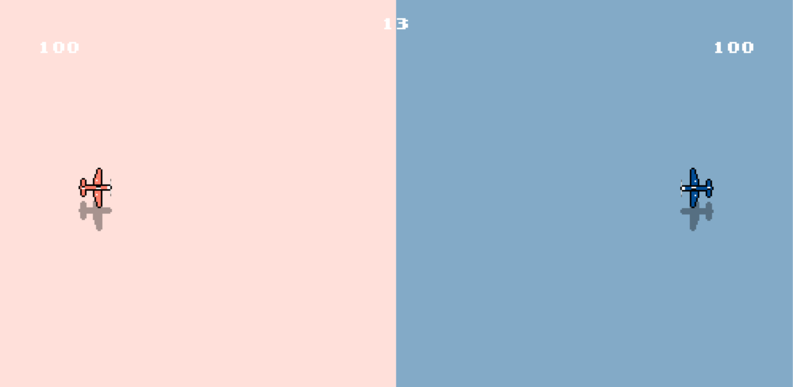

# Equilibrium

### About
This is a fun little side Project of mine.
My first game and first encounter with Deep Learning in C++.
The game utilizes the SDL2 framework and the training loop makes use of the Pytorch C++ frontend.
The Reinforcement Learning Agent is the combination of a Double and Dueling Deep Q Network architecture. 

### Rules
 A two player game. Each player pilots one plane, starting on opposing sides of the map, with 100 health points.
 Each health point corresponds to one tile on the map, colored in the players theme. If player A flies into 
 player B's tile, player B looses one health point, player A gains one and the tile changes colors. If player A
 shoots at player B and hits, player B will loose ten health points, player A will gain ten and ten randomly
 selected tiles from player B will change color to match the new score. Both rules apply vice versa. If one
 player manages to gain 200 health points or one minute has passed, the game ends. Winner is the player 
 with greater health.
 
 The Game can be played in Single player mode against the RL Agent or in a pvp fashion against other players on 
 the same machine.
 
### Dependencies
- SDL2
- SDL2-image
- SDL2-mixer
- SDL2-ttf
- libtorch